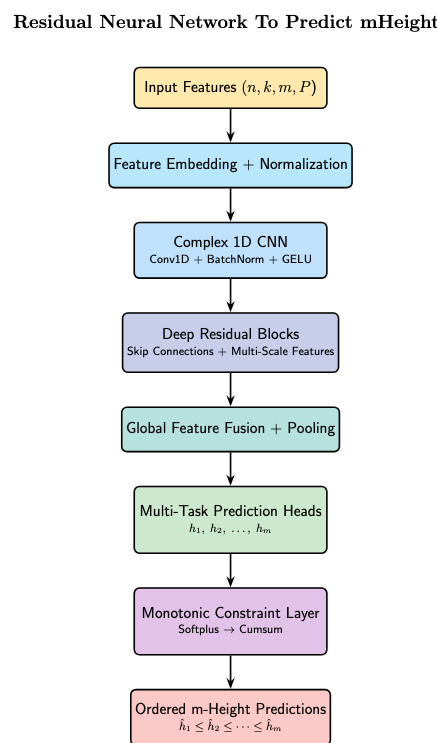

# Analog Code m-Height Predictor

**Analog Code m-Height Predictor** is a compact, constraint-aware learning system for fast **m-height prediction** using a **Multi-Task ResNet** with **1.4M parameters**. It is designed for domains wh[...]

## Project Overview

This project targets regression settings in which predicted quantities must remain **ordered**, **non-negative**, and **efficient to compute** at inference time. The model combines multi-task represen[...]

Three core ideas define the system:

- **O(1) inference time** per sample, enabling predictable deployment cost.
- **Structural monotonicity** via **Softplus** and **Cumsum**, which guarantees ordered output construction.
- **Log-space training**, which improves optimization when targets span wide dynamic ranges.

In practice, this makes the model useful for reliability-sensitive prediction tasks in engineering systems, communications, and storage infrastructure.

## Architecture

The model is a **Multi-Task ResNet** with approximately **1.4 million parameters**, chosen to balance expressiveness and deployment efficiency.

### High-level structure
<p align="center">
  
</p>


### Mathematical formulation

Let the shared backbone be a function

$$
\mathbf{h} = f_\theta(\mathbf{x})
$$

where $$\mathbf{x}$$ is the input and $$\mathbf{h}$$ is the learned latent representation.

For one prediction head, the network produces unconstrained logits:

$$
\mathbf{z} = g_\phi(\mathbf{h})
$$

To enforce non-negative increments, the model applies **Softplus** elementwise:

$$
\Delta_i = \text{Softplus}(z_i) = \log(1 + e^{z_i})
$$

The monotone m-height output is then constructed by cumulative summation:

$$
\hat{m}_i = \sum_{j=1}^{i} \Delta_j
$$

Since each $$\Delta_i \ge 0$$, it follows that

$$
\hat{m}_{i+1} \ge \hat{m}_i
$$

which gives **structural monotonicity by construction**.

### Multi-task objective

If the model predicts multiple related targets, the total training objective can be written as

$$
\mathcal{L}_{\text{total}} = \sum_{t=1}^{T} \lambda_t \mathcal{L}_t
$$

where $$T$$ is the number of tasks, $$\mathcal{L}_t$$ is the loss for task $$t$$, and $$\lambda_t$$ controls task weighting.

### Why this matters

- The **ResNet backbone** improves feature reuse and gradient flow.
- The **multi-task design** encourages shared structure across related targets.
- The **Softplus + Cumsum** output layer ensures valid ordered predictions.
- The **small parameter count** keeps deployment practical.

## Training Configuration

The proposed model was trained on a large-scale dataset containing over **2 million analog code samples** generated from algebraic and coding-theoretic constructions.

### Dataset Scale

| Property | Value |
|---|---|
| Training Samples | 2M+ |
| Input Dimension | 32 Features |
| Predicted Outputs | 5 Monotonic m-Heights |
| Batch Size | 1024 |
| Training Epochs | 200 |

---

## Data Examples

The exact dataset depends on the application, but the model is intended for structured numerical, encoded signal, or system-state inputs paired with one or more m-height targets.

### Example schema

```markdown
Input fields:
- Encoded analog/code descriptors
- Channel or noise measurements
- Reliability or redundancy indicators
- System context features

Target fields:
- Ordered m-height values
- Auxiliary regression targets for multi-task training
```

### Example sample

```text
Input
-----
code_embedding      = [0.21, -0.08, 0.73, 0.44]
noise_level         = 0.12
redundancy_factor   = 3
temperature_band    = 2

Output
------
m_height            = [0.12, 0.21, 0.26]
aux_target          = 0.91
```

### Example monotone construction

Given unconstrained logits:

$$
\mathbf{z} = [ -1.2, -0.4, 0.3 ]
$$

Applying Softplus gives positive increments:

$$
\Delta = [\text{Softplus}(-1.2),\; \text{Softplus}(-0.4),\; \text{Softplus}(0.3)]
$$

Numerically, this is approximately:

$$
\Delta \approx [0.263,\; 0.513,\; 0.854]
$$

Then cumulative summation yields:

$$
\hat{m} \approx [0.263,\; 0.776,\; 1.630]
$$

This guarantees an ordered output sequence without requiring post-processing.

## Key Properties

### Constant-time inference

For a fixed model architecture, inference cost per sample is constant with respect to deployment execution flow:

$$
\text{Inference Cost} = O(1)
$$

This is especially useful in production systems that require predictable latency and throughput.

### Log-space training

When targets vary over several orders of magnitude, it is often beneficial to optimize in log space. A typical transformed target is:

$$
 y' = \log(y + \epsilon)
$$

with small $$\epsilon > 0$$ for numerical safety.

A representative loss in log space is:

$$
\mathcal{L}_{\log} = \frac{1}{N} \sum_{i=1}^{N} \left( \log(y_i + \epsilon) - \log(\hat{y}_i + \epsilon) \right)^2
$$

This emphasizes **relative scale consistency** and often improves stability when large targets would otherwise dominate the gradient.

## Real-World Use Cases

### Satellite communication

Satellite communication systems often require fast prediction of operating margins, reliability behavior, or performance envelopes under changing link conditions. A compact monotone predictor is usefu[...]

Example applications:

- Predicting ordered link-margin behavior across signal conditions.
- Supporting adaptive coding and modulation decisions.
- Enabling low-latency inference in onboard or edge-adjacent systems.

### Cloud storage durability

Cloud storage platforms depend on robust estimates of durability, failure progression, and redundancy effectiveness. In these settings, monotone outputs can reflect naturally ordered reliability or de[...]

Example applications:

- Modeling durability across increasing redundancy levels.
- Forecasting failure-risk progression under environmental stress.
- Building fast surrogate models for storage system simulation.

### Other suitable domains

The same architecture can be useful in:

- Reliability engineering.
- Signal processing.
- Scientific surrogate modeling.
- Embedded diagnostics.
- Resource-constrained inference pipelines.

## Design Rationale

The core design can be summarized as follows:

1. Learn a shared representation with a residual backbone.
2. Predict task-specific latent outputs through lightweight heads.
3. Convert unconstrained values into positive increments with Softplus.
4. Enforce monotonicity using cumulative summation.
5. Train in log space when scale sensitivity makes direct regression unstable.

This combination gives a model that is compact, mathematically grounded, and deployment-oriented.

## Positioning

**Analog Code m-Height Predictor** is best viewed as a **small, fast, structure-aware prediction system**. Its value comes from combining:

- the representation strength of residual learning,
- the efficiency of a **1.4M-parameter** model,
- monotonicity guaranteed by architecture, and
- stable optimization through log-space objectives.

For teams building prediction systems in reliability-sensitive domains, this makes the project a strong fit for both research and production deployment.


## RESOURCES

Roth RM, Zhu Z, Yuan C, Siegel PH, Jiang A. 2026. On the Height Profile of Analog Error-Correcting Codes. arXiv:2602.20366 [cs.IT].[https://arxiv.org/abs/2602.20366]

Jiang A. 2024. Analog Error-Correcting Codes: Designs and Analysis. IEEE Transactions on Information Theory.[https://dl.acm.org/doi/10.1109/TIT.2024.3454059]
